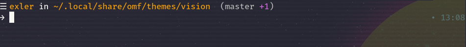

## Vision 
[](/LICENSE) 
[](http://fishshell.com)

> Minimalistic and informative theme, inspired by [Lambda](https://github.com/hasanozgan/theme-lambda) and [cmorrell](https://github.com/oh-my-fish/theme-cmorrell.com).

#### Screenshot

<p align="center">
	
</p>


#### Installation

* Place the theme files in the following folder:
```
~/.local/share/omf/themes/vision
``` 
* Enable the theme using Oh-My-Fish:
```bash
$ omf theme vision
```
