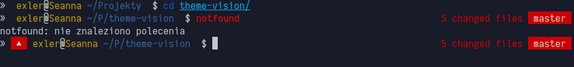

### Vision 
[](/LICENSE) 
[](http://fishshell.com)

> Minimalistic theme for Git users, inspired by [Lambda](https://github.com/hasanozgan/theme-lambda).

#### Screenshot

<p align="center">
	
</p>


#### Installation

* Install [Oh-My-Fish](https://github.com/oh-my-fish/oh-my-fish)
* Place the theme files in the following folder:
```
~/.local/share/omf/themes/vision
``` 
